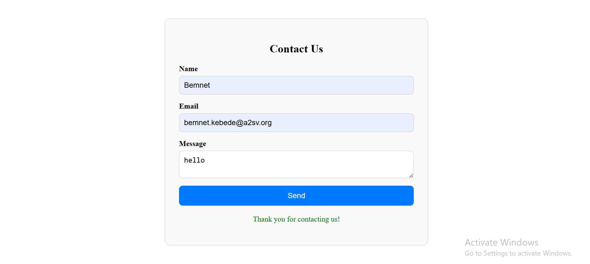
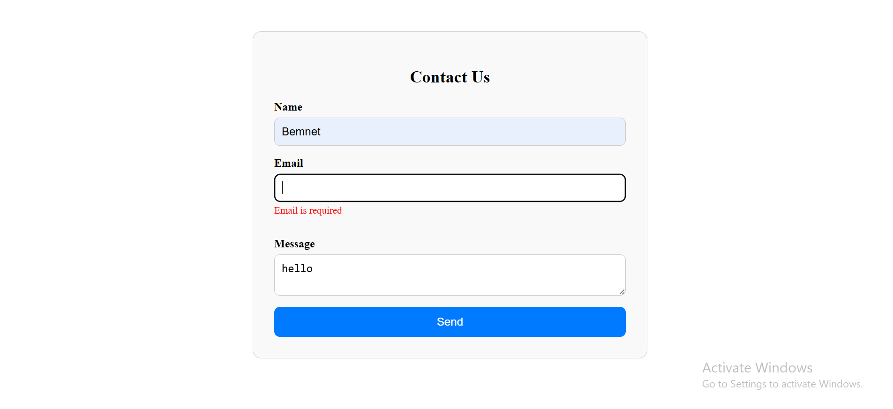

# 📬 Contact Form – React + TypeScript

This is a simple Contact Form project built using **React**, **TypeScript**, and the `react-hook-form` library. The form collects user input (Name, Email, and Message), validates it, and shows error or success messages. The UI is styled using external CSS.

---

## 🎯 Objectives

- Understand and implement the `useForm` hook from `react-hook-form`.
- Manage form state and validation in a React + TypeScript environment.
- Create a clean, responsive UI using external CSS.

---

## ✨ Features

- Form fields: Name, Email, and Message
- Field validation:
  - All fields are required
  - Email must be in valid format
- Error messages displayed for invalid inputs
- Success message after submission
- Clean and responsive design using external CSS

---

## 🛠️ Tech Stack

- React
- TypeScript
- react-hook-form
- CSS (external stylesheet)

---

## 📁 Project Structure
   contact-form/
    ├── public/
    ├── src/
    │ ├── components/
    │ │ └── ContactForm.tsx
    │ ├── styles/
    │ │ └── ContactForm.css
    │ ├── App.tsx
    │ ├── main.tsx / index.tsx
    ├── package.json
    ├── tsconfig.json
    └── README.md

---

## 🚀 How to Run the Project

### 1. Clone the Repository

bash
  git clone https://github.com/your-username/contact-form.git
  cd contact-form

### 2. Install Dependencies
    npm install

### 3.Start the App
  If using Vite:
    npm run dev
  If using Create React App:
    npm start

🧪 Testing the Form
Leave a field empty and try submitting to see validation errors.

Use an invalid email format (e.g., abc@) to test email validation.

Enter valid data and click "Send" to see the success message.

📸 Screenshots
✅ Successful Submission

❌ Invalid Email Error

     

