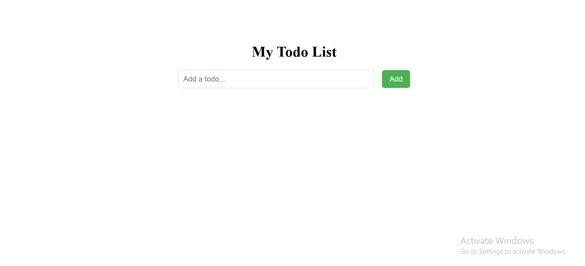
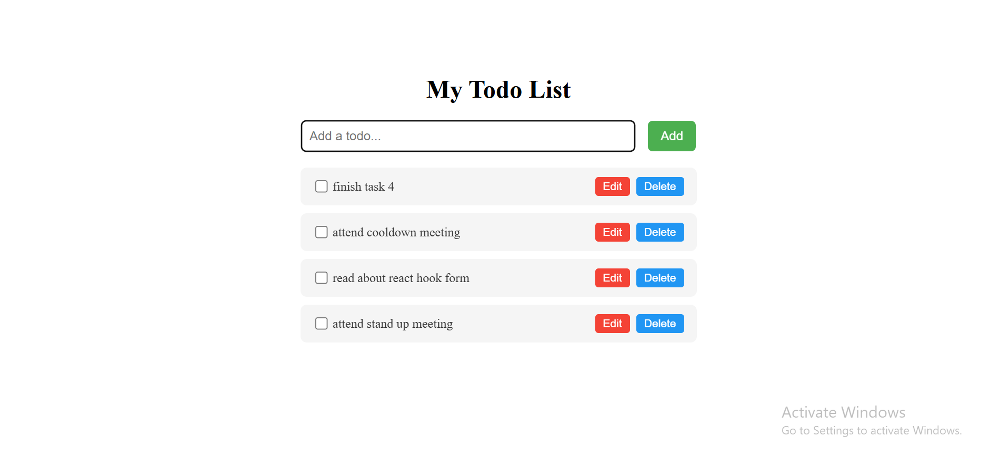
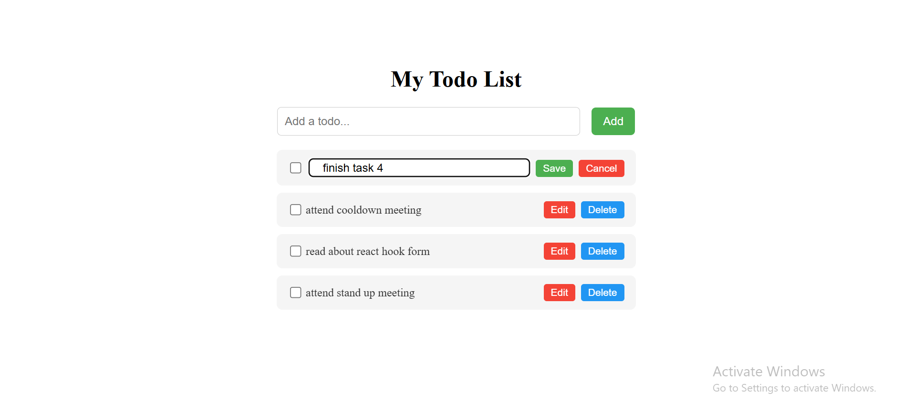
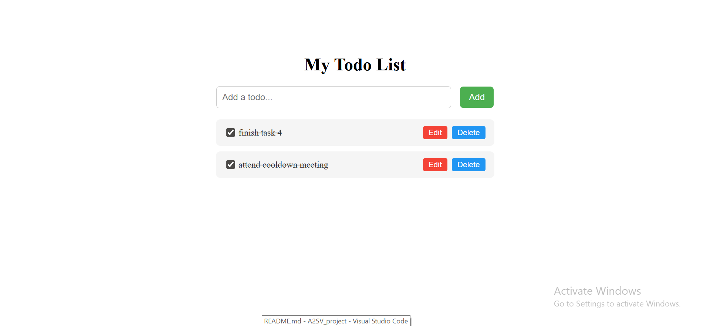
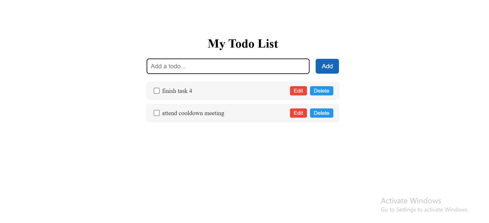

# ✅ Todo List App – React + TypeScript

This is a simple Todo List application built using **React** and **TypeScript**. It allows users to **add**, **edit**, and **delete** tasks. The project follows modern frontend development practices using components, hooks, and basic CSS styling.

## 🎯 Objective

The goal of this project is to:

- Learn how to build applications with **React and TypeScript**
- Understand the use of **components**, **props**, **state**, and **hooks**
- Apply styling using **CSS**
- Practice clean code structure and file organization
- Gain experience deploying projects to **GitHub**

---

## 🛠️ Features

🏠 Main Interface

Clean and simple UI with input, add button, and task list.

➕ Adding a Task


User enters a task and clicks 'Add'.

✏️ Editing a Task


Click 'Edit' to modify a task and 'Save' to update it.

✅ Completing a Task


Check the box to mark a task as done — it removes the task from the list.

❌ Deleting a Task


Click 'Delete' to remove the task.

---

## 📁 Folder Structure
    task_four/
    ├── public/
    ├── src/
    │ ├── components/
    │ │ ├── TodoForm.tsx
    │ │ ├── TodoForm.tsx
    │ │
    │ │ 
    │ ├── types/
    │ │ └── todo.ts
    │ ├── App.tsx
    │ ├── index.tsx
    │ └── styles.css
    ├── package.json
    ├── tsconfig.json
    └── README.md


---

## ⚙️ How to Run

1. **Clone the Repository:**
   ```bash
   git clone https://github.com/your-username/todo-typescript-app.git
   cd task_four

2. Compile TypeScript:
Make sure TypeScript is installed globally:
   npm install -g typescript
3. Open in Browser:
Just open index.html in your preferred browser. No server setup needed.


