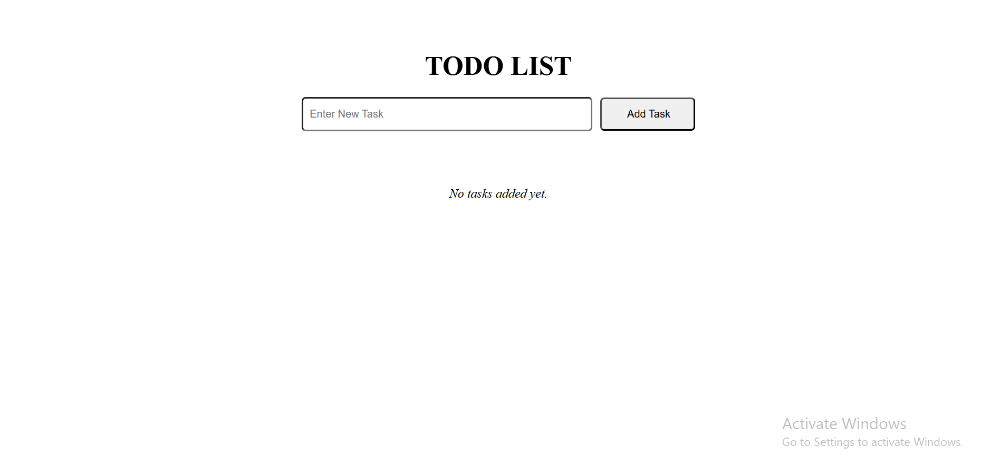
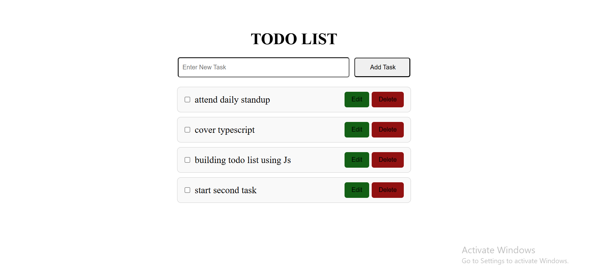
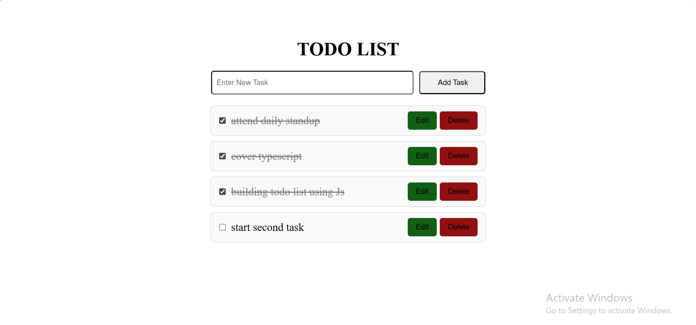
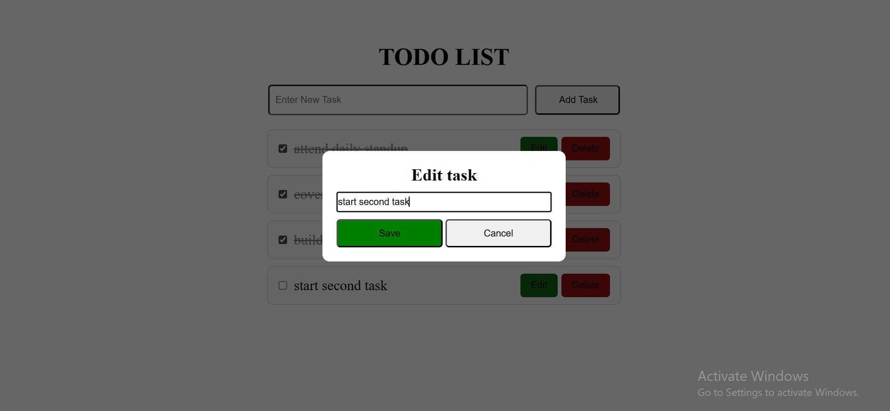
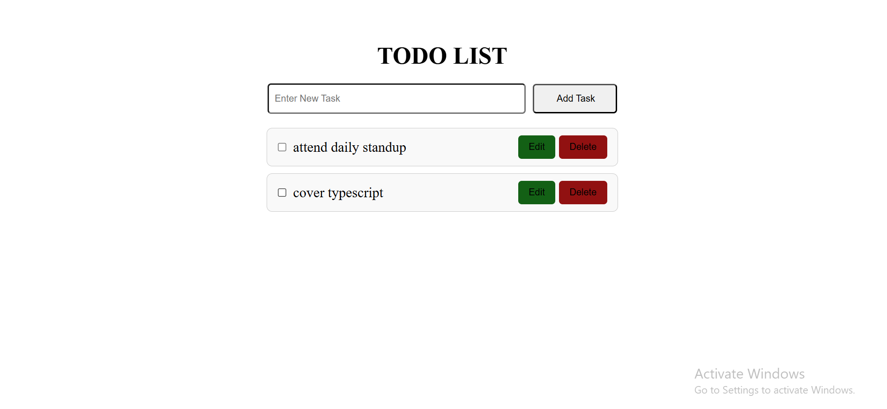

# 📝 Todo List App

This is a simple, user-friendly Todo List web application built with HTML, CSS, and JavaScript. It allows users to:

- ✅ Add new tasks  
- ✅ Mark tasks as completed with a checkbox  
- ✅ Edit tasks with a modal input  
- ✅ Delete tasks  
- ✅ See a message when there are no tasks  

The design is clean and modern — perfect for beginner web development projects.

---

## 🏠 Home Page (Initial View)

When you first load the app, you’ll see an input field and an “Add Task” button, along with a message:  
**“📝 No tasks yet. Add something!”**

---

## ➕ Adding a Task

Type a task in the input field and click the “Add Task” button.  
Each task includes:

- ✅ A checkbox to mark it as completed  
- ✏️ An Edit button  
- 🗑️ A Delete button  

---

## ✅ Mark Task as Completed

Tick the checkbox to strike through the task and mark it as complete.

---

## 📝 Editing a Task

Click the **Edit** button to open a modal.  
Update the text, then click **Save**.

---

## ❌ Deleting a Task

Click **Delete** to remove the task from the list.  
When all tasks are deleted, the **“No tasks yet”** message will reappear automatically.
---

## 📁 Project Structure
    todo-list-app/
    │
    ├── index.html # Main HTML structure
    ├── style.css # All styles
    ├── script.js # JavaScript logic
    ├── README.md # This documentation
    └── screenshots/ # Screenshots used in README

## 🚀 Getting Started
    ✅ Requirements
        * A modern web browser (Chrome, Firefox, Edge, etc.)
        * [Optional] A local server like Live Server for smoother experience
    📦 Run Locally

        1. Clone this repository or download the ZIP:
            https://github.com/Bemnetkebede/A2sv_Web_track_projects

        2. Navigate to the project directory:
            cd task_one_todo-list

        3. Open index.html in your browser OR Use a local server like Live Server for best experience.

