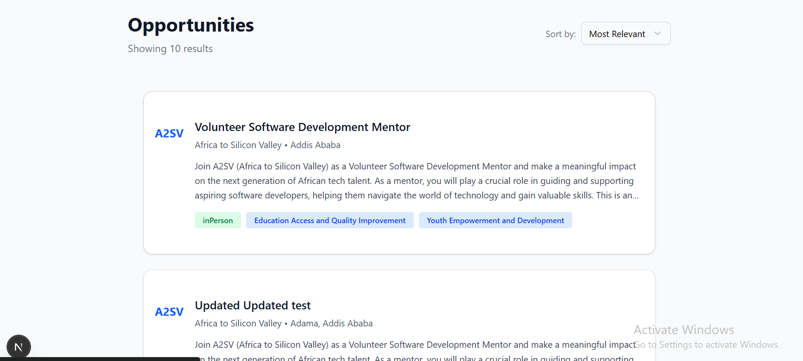
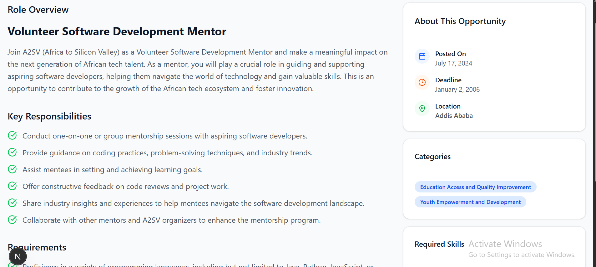

# Job Opportunities Application
A Next.js application that integrates with the Akil Backend API to display job opportunities with detailed views.

## Features

- **API Integration using RTK Query.
- **Dynamic Routing for job detail pages.
- **Loading and Error Handling with styled fallback UIs.
- **Component-Based Architecture (JobCard, JobDetail).
- **Responsive UI using Tailwind CSS.
- **  API Integration
-

## Technical Implementation

### Data Fetching
- Uses Next.js App Router with Server Components for optimal performance
- Implements proper error handling for failed API requests
- Includes retry functionality for network failures
- Uses TypeScript interfaces for type safety

### Error Handling
- Graceful handling of network errors
- User-friendly error messages
- Retry mechanisms for failed requests
- Fallback UI states for error scenarios

### Code Organization
- Clean separation of concerns with dedicated API layer (`lib/api.ts`)
- Reusable components with proper TypeScript typing
- Consistent code formatting and commenting
- Follows Next.js and React best practices

## Screenshots

### Opportunities Dashboard

*The main dashboard showing a list of available job opportunities with filtering and sorting options. Each card displays key information including job title, company, location, description, and relevant tags.*

### Job Description View

*Detailed view of a specific job opportunity showing comprehensive information including role overview, key responsibilities, requirements, and company details. The sidebar provides quick access to important dates, location, and categorization.*

## Getting Started

1. **Clone the repository**
   \`\`\`bash
   git clone <repository-url>
   cd job-opportunities-app
   \`\`\`

2. **Install dependencies**
   \`\`\`bash
   npm install
   \`\`\`

3. **Run the development server**
   \`\`\`bash
   npm run dev
   \`\`\`

4. **Open your browser**
   Navigate to `http://localhost:3000` to view the application

## Project Structure

\`\`\`
├── app/
│   ├── page.tsx                 # Home page (opportunities listing)
│   ├── opportunities/
│   │   └── [id]/
│   │       └── page.tsx         # Individual opportunity detail page
│   ├── layout.tsx               # Root layout
│   └── globals.css              # Global styles
├── components/
│   ├── opportunities-page.tsx   # Main opportunities listing component
│   ├── job-detail-page.tsx      # Job detail view component
│   └── ui/                      # Reusable UI components
├── lib/
│   └── api.ts                   # API integration layer
└── public/
    └── images/                  # Screenshot images
\`\`\`