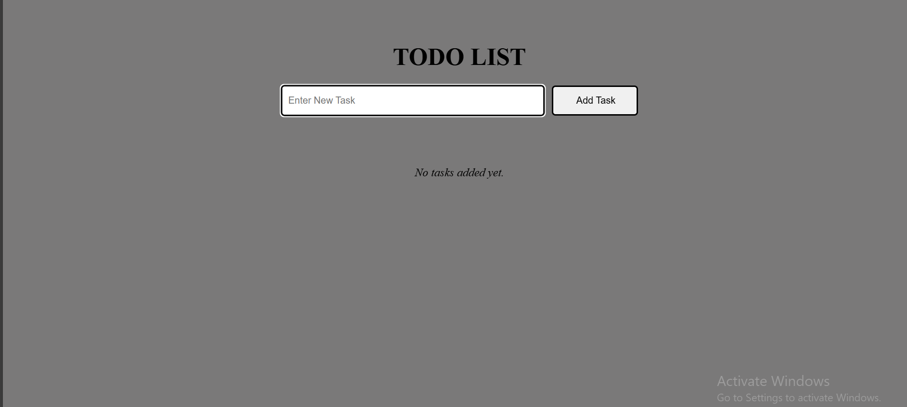
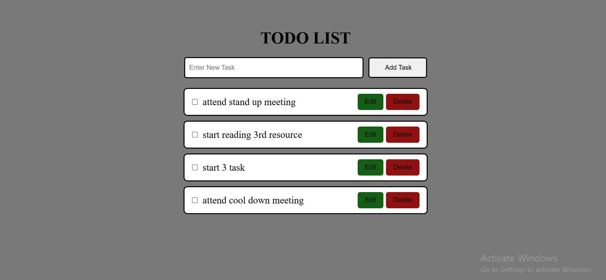
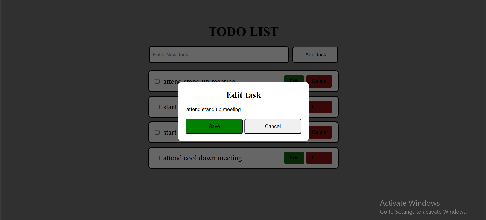
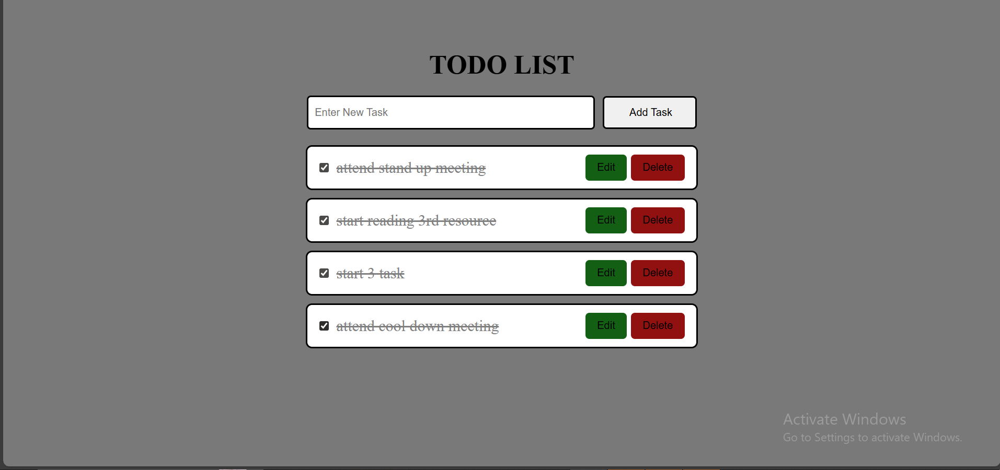
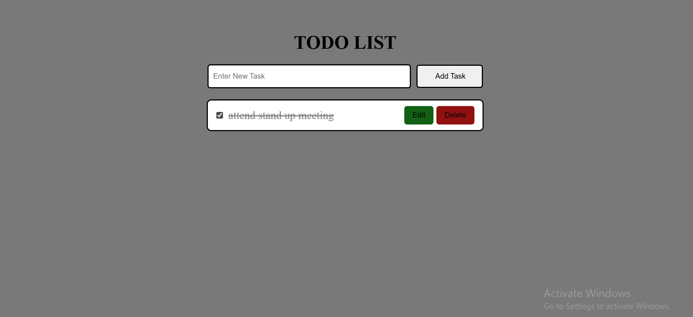
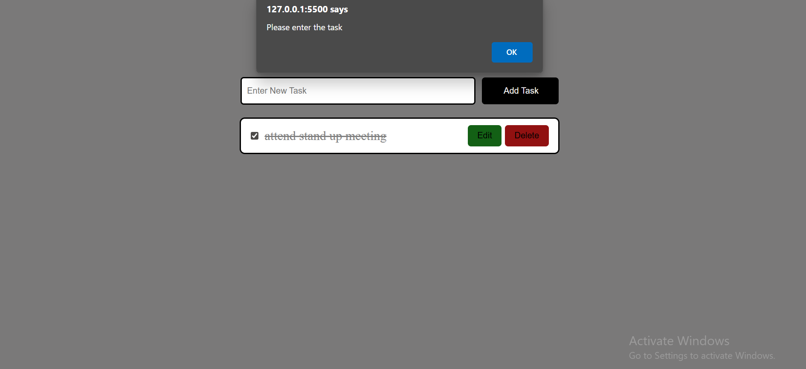

# 📝 Simple Todo List App – TypeScript

This is a basic **Todo List Application** built using **TypeScript**, allowing users to add, edit, delete, and complete tasks.  
The app demonstrates core TypeScript concepts such as interfaces, event handling, DOM manipulation, and optional `localStorage` integration.

---

## 🚀 Features

- ✅ Add a new task  
- 📝 Edit a task  
- ❌ Delete a task  
- ✅ Mark tasks as completed  
- ⚠️ Input validation (prevents empty tasks)  
<!-- - 📦 Save tasks using browser localStorage (optional) -->

---

## 🧠 Technologies Used

- **TypeScript**
- **HTML & CSS**
- **No external libraries**

---


## 📁 Project Structure
todo-list-ts/
├── dist/                    # Compiled JavaScript (after running tsc)
│   └── todo.js             
├── src/                     # Your source TypeScript files
│   └── todo.ts
├── index.html               # Your HTML file (entry point)
├── styles.css               # Optional: CSS styles
├── tsconfig.json            # TypeScript config file
├── README.md                # Your project documentation
├── package.json             # Optional: if you're using npm
└── .gitignore               # To ignore node_modules, etc.


---

## ⚙️ How to Run

1. **Clone the Repository:**
   ```bash
   git clone https://github.com/your-username/todo-typescript-app.git
   cd todo-typescript-app
2. Compile TypeScript:
Make sure TypeScript is installed globally:
   npm install -g typescript
3. Open in Browser:
Just open index.html in your preferred browser. No server setup needed.

🏠 Main Interface

Clean and simple UI with input, add button, and task list.

➕ Adding a Task


User enters a task and clicks 'Add'.

✏️ Editing a Task


Click 'Edit' to modify a task and 'Save' to update it.

✅ Completing a Task


Check the box to mark a task as done — it removes the task from the list.

❌ Deleting a Task


Click 'Delete' to remove the task.

- ⚠️ Input validation (prevents empty tasks)



